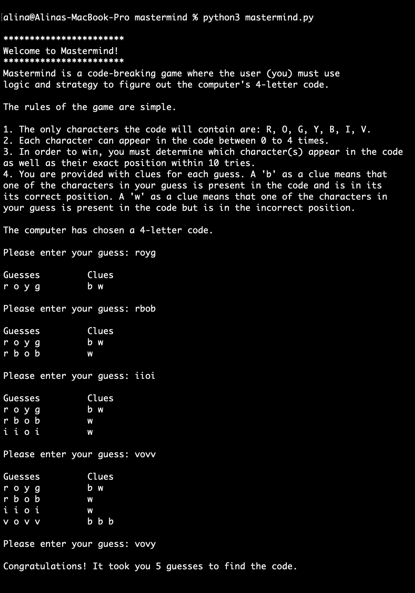

# Mastermind

## Languages
* Python

## What Is It?
- A command line version of the classic logic game Mastermind. It allows the user to play
against the computer and attempt to figure out the computer's auto-generated 4-letter code.

- The code can only consist of the following letters: r, o, y, g, b, i, and v, and within 10
attempts, the user must figure out which letters are in the code and their correct position.

- For each guess, the user is given feedback clues: a 'b' if they have the correct letter in
the correct position or a 'w' if they have the correct letter in an incorrect position.

## How To Use?
Use the following commands to run the program:
```
git clone https://github.com/alina-tariq/mastermind.git
cd mastermind
python3 mastermind.py
```

## Demo

